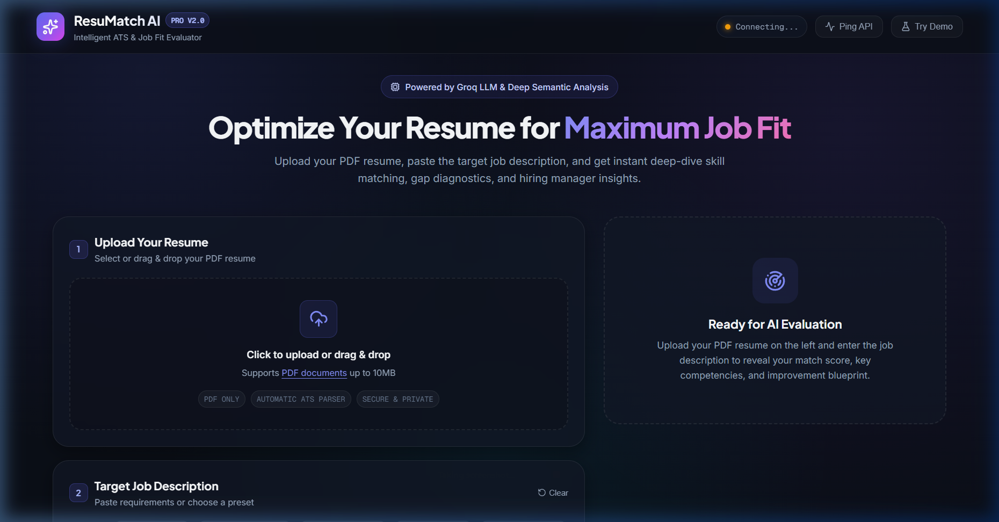
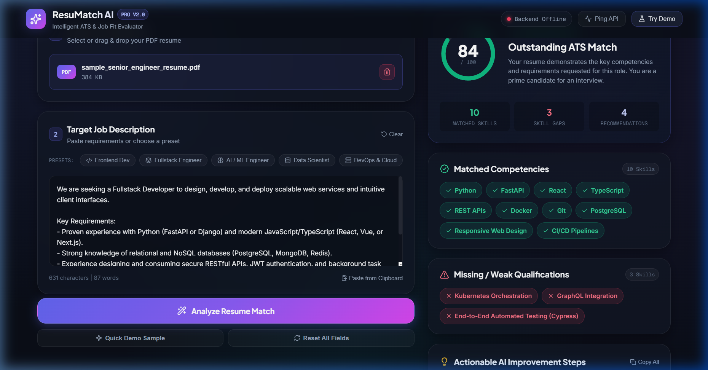
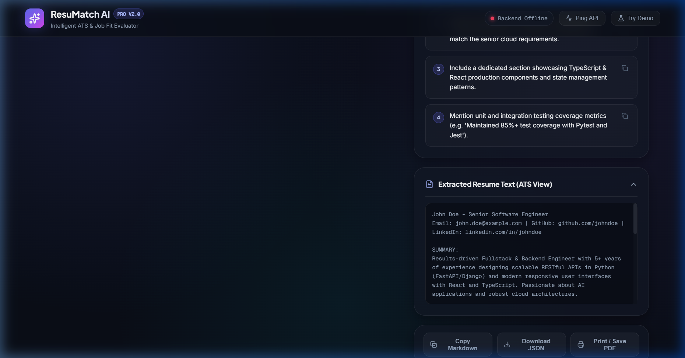

# ResuMatch AI — Intelligent Resume Analyzer and Job Matcher

ResuMatch AI is an automated resume evaluation system designed to bridge the gap between candidate qualifications and employer expectations. By combining fast PDF parsing with large language model semantic analysis powered by Groq and FastAPI, ResuMatch AI analyzes candidate resumes against specific job descriptions, computes an objective compatibility score, detects skill proficiencies and gaps, and delivers actionable recommendations for resume optimization.

---

## Visual Overview

### 1. Workspace Interface
The primary application interface provides a clean, two-column workspace featuring drag-and-drop resume upload, role presets, and live backend connectivity monitoring.



### 2. Evaluation Intelligence Dashboard
Upon processing, the system renders an interactive evaluation dashboard featuring an animated circular match score, categorized competencies, identified skill gaps, and prioritized recommendations.



### 3. Extracted ATS Plain-Text Inspection
Users can inspect the exact plain-text representation extracted by the ATS parser to verify formatting integrity and keyword extraction before applying.



---

## Key Features

- **Automated PDF Parsing**: Extracts clean plain text from PDF resumes using `pypdf` without requiring third-party cloud conversion services.
- **Deep Semantic Matching**: Evaluates candidate experience against detailed job requirements using Groq's high-speed inference engine.
- **Dynamic Compatibility Scoring**: Calculates a normalized 0 to 100 compatibility score reflecting technical qualification, experience alignment, and keyword relevance.
- **Skill Gap Diagnostics**: Identifies matched competencies while explicitly categorizing missing or underrepresented technical requirements.
- **Actionable Optimization Steps**: Generates tailored, high-impact suggestions to enhance resume bullet points and highlight relevant domain experience.
- **One-Click Role Presets**: Includes pre-configured industry job descriptions for Frontend, Fullstack, AI/ML, Data Science, and DevOps roles for rapid benchmarking.
- **Offline Demonstration Mode**: Allows instant testing of the user interface and reporting capabilities even when backend services are offline.
- **Multi-Format Report Export**: Supports exporting evaluation summaries to clipboard-ready Markdown, raw JSON download, or print-ready PDF formats.

---

## System Architecture

The application is structured into decoupled frontend and backend layers for maintainability and minimal latency.

```
[ Candidate PDF Resume ]       [ Target Job Description ]
           │                               │
           └───────────────┬───────────────┘
                           ▼
              FastAPI Processing Pipeline
                           │
           ┌───────────────┴───────────────┐
           ▼                               ▼
  PDF Text Extraction             Context Construction
     (pypdf Reader)            (Prompt Template & Rules)
           │                               │
           └───────────────┬───────────────┘
                           ▼
                Groq LLM Inference API
              (Structured JSON Output)
                           │
                           ▼
          Interactive Glassmorphic Frontend
        (Score Gauge, Badges, Suggestions, Export)
```

---

## Technology Stack

### Backend
- **Framework**: FastAPI (Python 3.10+)
- **Inference Engine**: Groq Python SDK (High-performance LLM completion)
- **PDF Extraction**: pypdf
- **Server**: Uvicorn ASGI Server
- **CORS Support**: FastAPI CORSMiddleware

### Frontend
- **Structure**: Semantic HTML5
- **Styling**: Vanilla CSS3 with Glassmorphic Design System (Obsidian Palette, Custom Radii, CSS Variables)
- **Typography**: Google Fonts (Inter, Plus Jakarta Sans, Geist Mono)
- **Iconography**: Lucide Icons
- **Scripting**: Native ES6+ JavaScript (Fetch API, Drag and Drop API, Clipboard API)

---

## Project Structure

```
AI resume analyzer/
├── Backend/
│   ├── ai_analyzer.py      # Module helper for LLM routines
│   ├── main.py             # FastAPI entrypoint, routing, and Groq integration
│   ├── resume_parser.py    # PDF text extraction logic using pypdf
│   ├── temp_resume.pdf     # Temporary storage buffer for uploaded PDF
│   └── test_groq.py        # Independent connection testing utility
├── Frontend/
│   ├── index.html          # Application structure and layout
│   ├── script.js           # Frontend controller, events, and API client
│   └── style.css           # Glassmorphism styling and responsive layout
├── Screenshots/
│   ├── analysis_dashboard.png
│   ├── ats_extracted_view.png
│   └── initial_interface.png
└── README.md
```

---

## Prerequisites

Before running the application, ensure the following software is installed on your system:

- Python 3.10 or higher
- Node.js (optional, only if using static server tools like `serve` or `http-server`)
- A valid Groq Cloud API Key (obtainable from the Groq Developer Console)

---

## Installation and Setup

### 1. Clone or Open the Repository

```bash
git clone <repository-url>
cd "AI resume analyzer"
```

### 2. Configure the Backend

Navigate to the `Backend` directory:

```bash
cd Backend
```

Create a virtual environment (recommended):

```bash
# Windows
python -m venv venv
venv\Scripts\activate

# Linux / macOS
python3 -m venv venv
source venv/bin/activate
```

Install the required Python dependencies:

```bash
pip install fastapi uvicorn groq pypdf python-multipart
```

Set your Groq API key in your environment:

```bash
# Windows Command Prompt
set GROQ_API_KEY=your_actual_groq_api_key_here

# Windows PowerShell
$env:GROQ_API_KEY="your_actual_groq_api_key_here"

# Linux / macOS
export GROQ_API_KEY="your_actual_groq_api_key_here"
```

### 3. Start the FastAPI Server

Run the backend server using Uvicorn:

```bash
uvicorn main:app --reload --host 127.0.0.1 --port 8000
```

The API will become accessible at `http://127.0.0.1:8000`. You can verify that the server is operational by opening `http://127.0.0.1:8000/docs` in your browser to view the interactive Swagger documentation.

### 4. Launch the Frontend

Open `Frontend/index.html` directly in your browser:

- Double-click `Frontend/index.html` in your file explorer, OR
- Serve it using a lightweight local HTTP server:

```bash
# Using Python built-in server
cd ../Frontend
python -m http.server 5500
```

Then visit `http://127.0.0.1:5500` in your web browser.

---

## API Documentation

### 1. Health Check
- **Endpoint**: `GET /`
- **Description**: Returns server operational status.
- **Response**:
  ```json
  {
    "message": "AI Resume Analyzer Backend is working!"
  }
  ```

### 2. Upload and Extract Resume
- **Endpoint**: `POST /upload-resume`
- **Content-Type**: `multipart/form-data`
- **Parameters**:
  - `resume`: Binary PDF file (`UploadFile`)
- **Response**:
  ```json
  {
    "filename": "sample_resume.pdf",
    "message": "Resume read successfully!",
    "text": "Extracted text content..."
  }
  ```

### 3. Analyze Resume Against Job Description
- **Endpoint**: `POST /analyze-resume`
- **Content-Type**: `multipart/form-data`
- **Parameters**:
  - `resume`: Binary PDF file (`UploadFile`)
  - `job_description`: Plain text job requirements (`str`)
- **Response Format**:
  ```json
  {
    "filename": "sample_resume.pdf",
    "analysis": {
      "score": 84,
      "matched_skills": [
        "Python",
        "FastAPI",
        "React",
        "Docker"
      ],
      "missing_skills": [
        "Kubernetes Orchestration",
        "GraphQL"
      ],
      "suggestions": [
        "Quantify your backend performance achievements.",
        "Add explicit container orchestration experience to align with cloud requirements."
      ]
    }
  }
  ```

---

## Evaluation Workflow Guide

1. **Upload Resume**: Select your resume file in `.pdf` format by clicking or dragging into the upload container.
2. **Specify Target Job**: Paste the exact job description into the text area or select one of the provided role presets.
3. **Execute Analysis**: Click **Analyze Resume Match**. The system will process the document and return structured insights within seconds.
4. **Review Results**:
   - Check the **Match Score** for an overall alignment percentage.
   - Inspect **Matched Competencies** to confirm key strengths recognized by ATS algorithms.
   - Review **Missing Qualifications** to identify skill gaps.
   - Read **Improvement Steps** for actionable resume refinement advice.
5. **Export Report**: Use the export toolbar to copy a formatted Markdown summary, download the raw JSON output, or print the evaluation report.

---

## Contributing and Improvements

Contributions are welcome. Potential enhancement areas include:
- Support for additional document formats (`.docx`, `.txt`, `.rtf`).
- Customizable LLM model selection and temperature parameters.
- Multi-resume candidate comparison and batch ranking for recruiters.
- Integration with local open-weights models using Ollama or vLLM.

---

## License

This project is open source and available under the MIT License.
